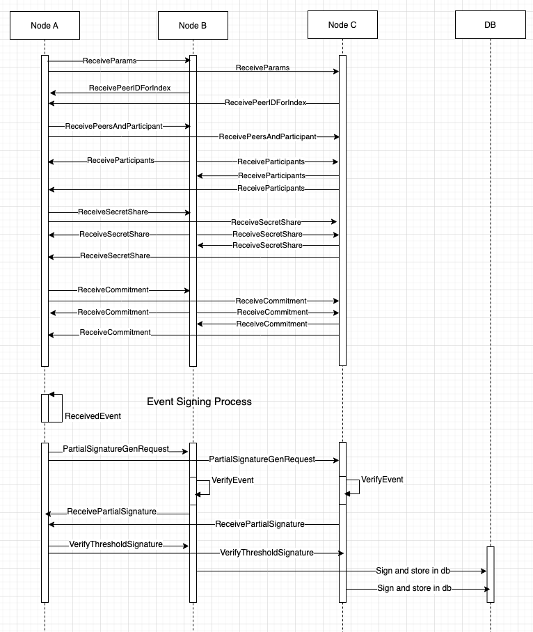

# TSS Process:
First collector nodes publishes the tss_params (total number of nodes and threshold number of nodes) either it gets the params from cli or using the default one: n3 t2 where n is total number of nodes and t is threshold nnumber of nodes. After each node receives params they publish their peer id to collector node. which then choose the first n number of peers and make a list of participants which will work in tss process. then it publishes the list of participants and its participant share to network. Then each node creates a participant for itself which creates a distrubuted secret share which is then published to network and each node gets its distributed share from that msg to go to round two of participant. After acheiving round two participant state is finished which generates group_key and each participants secret_key and from secret_key we can also generate public_key. Each participant generates a commitment share for the TSS process round which is then published to the network.
<br />
When a message is received to be signed then a node is chosen as aggregator node. which then makes the aggregator by passing it the msg and context( hard coded string unique to applicaiton). and include the commitment signers in it using which we get the signers list and we publish that list to the network. Each node checks if it is in signer list if yes they will sign the published msg and will send back their partial signature. Aggregator node then receives partial signature and adds it to aggregator object which then finalize and aggregate threshold signature. This generates cumulative threshold signature which is published to network and any node having the group_key and message hash can verify if the signature is valid or not. After signature is verified, each node can sign the msg with there account and store the message and signature to the database.
<br />


## Building
To run this build make sure you have protobuf installed.
For mac use: <br />
```Bash
brew install protobuf
```

For linux use: <br />
```Bash
sudo apt-get install protobuf-compiler
```
## Testing TSS process:
To test tss process you need 3 nodes (hard coded for now). Either it can be a boot node or 2 normal nodes. or it can be 3 normal nodes in the same netowrk without any boot node. To start a node you can use command <br />
`cargo run`<br />
to start a new node from the same computer you can use command<br />
`cargo run -- --new-node=true`<br />
<br />
you must assign at least one node as aggregator and collector in file:<br />
```
src
|_main.rs <= (line 96)
```
change the peer id with one of your node's peer id to assign that node collector and aggregator.
After running 3 nodes they will discover each other and will start tss distributed key generation process. After Participant state is finalized nodes now can sign events.<br />
Events automatically send from connector

## TSS Sequence Diagram


## Development Notes
tss get's the event from connector and sign it, then mpsc. tss get the signed event from other node, verify it and check threshold. event with finalization will be signed by an account and stored in db.

##  development plan:
- [] tss can get event data from connector
- [] tss use the account created to sign event
- [] tss verify event signature from other node
- [] tss can store data in db.